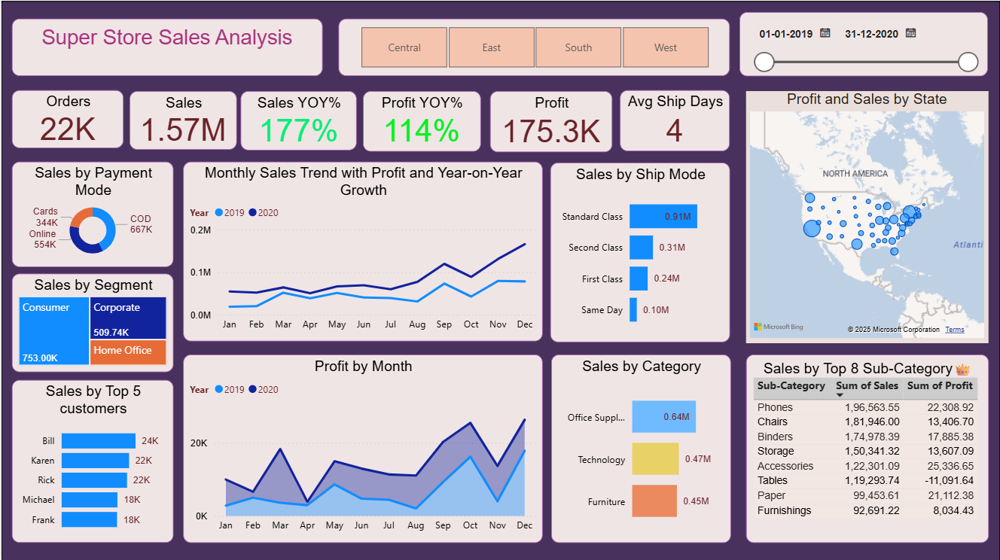
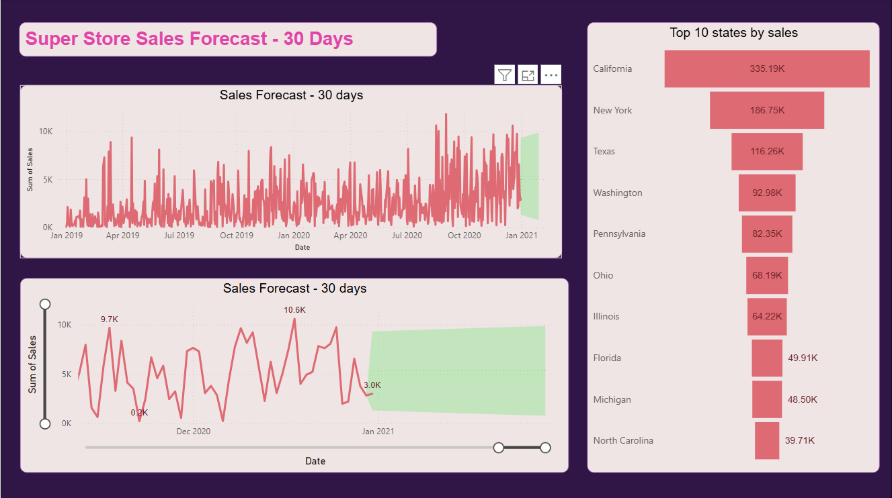

🛒 **Superstore Sales Analysis & Forecast Dashboard**

📊 **Project Overview**
This Power BI project focuses on analyzing and forecasting sales performance for a Superstore dataset. The goal is to understand sales trends, profit behavior, and customer patterns across regions and time periods, and to predict upcoming sales using Power BI’s forecasting features.

🧾 **Dataset**
File Used: Superstore_Sales_Dataset.xlsx
Contains order, customer, product, shipping, and sales details.
Added a Calendar Table and created extra columns using DAX for:
Year-on-Year (YoY) Growth in Sales and Profit
Average Shipping Days
Date-based analysis and comparisons

⚙️ **Data Modeling & Process**
Cleaned and prepared the data in Power BI.
Built model relationships between fact and dimension tables.
Used DAX for calculated columns and measures.
Designed two dashboards — one for Sales Analysis and another for Sales Forecast.

📈 **Dashboard Details**
🟣 **Superstore Sales Analysis**
KPIs: Total Orders, Sales, Profit, YoY Growth, Avg. Shipping Days
Sales by Category, Segment, State, and Payment Mode
Monthly trend of Sales and Profit (2019–2020)
Top 5 Customers and Top 8 Sub-Categories
Regional view with interactive filters
🔴 **Superstore Sales Forecast**
30-day sales forecast using Power BI’s built-in analytics
Historical trend from 2019–2021
Top 10 States by Sales

**Key Insights**
Sales grew by 177% YoY and profit by 114% YoY.
Consumer segment had the highest contribution to sales.
Standard Class is the most used shipping mode.
California, New York, and Texas are top-performing states.
The forecast shows stable and positive growth in upcoming days.

🛠️ **Tools Used**
Power BI Desktop
Microsoft Excel (for dataset)
DAX (for calculations and KPIs)

🖼️ **Dashboard Preview**

**About**
In my Power BI learning journey, I built this project to explore end-to-end data analysis — from data cleaning and modeling to DAX calculations and dashboard design. It helped me strengthen my understanding of Power BI’s analytical capabilities, time intelligence functions, and visualization techniques while working on real-world sales data.
